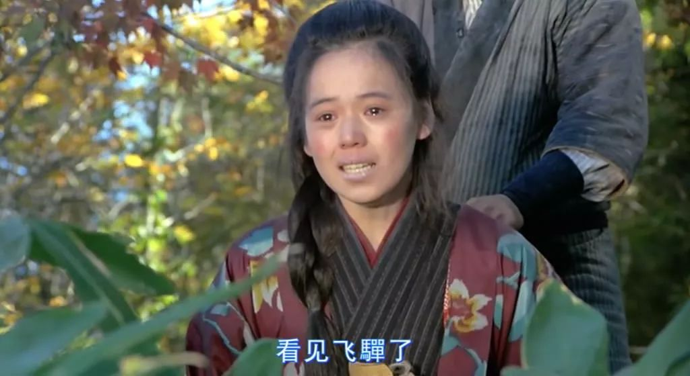

# 《小王子》 2015

## 认识小王子

这是一个十分强调生产效率的时代，每个人都以生产活动为中心，这种对效率的强调，要求着每个人按着冷酷无情的物质生产最优化规则来规划一切的生活：小孩子要按着细致入微的时间安排，去准备入学；孩子的家长要时时刻刻盯着手表，不敢错过不知何时就定下的会议；写字间、流水线上的大人，被要求不能保留小孩的天真浪漫、对世界的好奇探索，被送入工作地点之前，要接受意识形态教育机器的清洗。毫无疑问，这是一个极端技术统治下的赛博朋克资本主义世界。

女孩在被安排得明明白白的人生规划中，开始了自己的暑假生活，面对规划到死亡的日程，女孩起初是毫无怨言、毫无质疑、顺从地接受，直到他遇见到隔壁家的“怪老头”。

和蔼、神经大条的老人，住着老式的房子，与周边高效率统一修建的单元楼，有着“不合群”的样式，这是带有坚守的对磨平多样性的拒绝。于是，在这个世界的人目光里，他是一个固执的“怪老头”。他一直在试图修复那家老式飞机，他曾经架着它，在沙漠中遇见了小王子。

小王子在自己的星球上与玫瑰建立了羁绊，在玫瑰的自大占有中，小王子回避了这段关系，开始星球拜访的旅程。小王子拜访了控制欲强烈的国王、自大的居民、贪婪的商人，但小王子仍旧保持他的纯真；来到地球后遇到了智慧的蛇；与狐狸建立了友谊，互相温暖依靠，建立了美好的羁绊。年轻时的老人，穿越沙漠时飞机出故障而降落，在沮丧中，小王子走到了他身边。

小王子身上所代表的真善美，让老人念念不忘，女孩沉迷到了这个故事中。没有被规训的小孩，身上的天真无暇能很自然地在小王子的故事中，发出共鸣。女孩开始体会到了作为人的乐趣，她不再是一个被无情操控的提线木偶。她开始反抗这种无情的规训制度。

## 寻找小王子

老人病倒了，小女孩知道他需要小王子的帮助，于是架着老人那架承载着故事的飞机，颠簸地踏上了寻找小王子的路程。女孩也如小王子般，在自己的世界里遇到了那些控制欲强、自大、贪婪的人。在麻木的人群中，女孩找到了小王子。原来小王子就在我们身边，只是他长成了人们口中的“大人”，唯唯诺诺，顺着秩序不敢反抗（电影里面有个细节，女孩启动飞机时不小心让铁罐子砸到小王子的脸，但小王子却说是我不对，是我迎上去的），他已经在教育机器的清洗中，失去了自己的纯真，物化成工作机器，并主动遵守拥抱着秩序。

## 拯救小王子

小王子，被异化了，其境遇正如现实中的你我。但小王子的对自由、心灵完整的渴望与记忆，并没有彻底抹杀掉。他在女孩的呼唤中醒了过来，合力打倒坏人后，架着飞机，回到了小王子的星球。

玫瑰已经凋谢，但永远留存在了小王子心中，化为了满天星星守护着小王子。小王子找回了他的纯真，他也学会了爱。女孩去医院看望老人，解除了误会，建立了“会流泪”的羁绊；妈妈在理解女儿的真实需要后，开始陪伴在女孩身边，给予照顾与温暖。

电影圆满了，但我却感伤了，现实中人们的低落还在继续，我们仍旧生活在阶级社会中，被要求成为低头苦干，默不作声，唯唯诺诺的工具人。但我对人类的命运是乐观的，我知道小王子一直在我们心中，Ta只是被压制了，Ta一直都在，已经融入在我们血液里，在我们坚韧的生存中，在人与人的社会关系中，希望就像照耀在头上的星星，从未远离，天黑的时候才看得见。

# 《啊！野麦岭》

暴力裁员、251、《啊！野麦岭》 - 知乎  https://zhuanlan.zhihu.com/p/100467300

你们都是抽丝的活机器，抽不出丝就得报废。——《啊！野麦岭》

## 背景

日本经过明治维新迅速走上资本主义道路，一方面作为后发国家，日本的产品输出主要是生丝等纺织品，用纺织品的利润输入重工业、军工；另一方面由于人多地少，土地兼并，农业税沉重等原因，大批日本劳动者离开土地进入工厂寻找吃饭的机会——他们成了日本发展资本主义的薪柴。

日本工厂开始享受来自农村的人口红利，1903年日俄大战前夕，军火需求激增。相比以往，使得日本更加迫切地需要增加生丝出口换取外汇，进口军火偿还外债。在这种背景下，我们的故事《啊，野麦岭》展开了。

## 剧情

一群生丝工厂的工头去招工，要求女工签订卖身契，需要干满三年，期间不能擅自离开，也不能从事其他行业，如果违反除了赔偿定金5日元，还要支付违约金50日元。需要注意的是，这种工头和劳务派遣公司有相似之处，但请读者不要恶意联想。

女工的父母拿了钱，签订卖身契，女工们就跟着工头上路了。女主角阿枫签订卖身契的时候，还不到14周岁，女工们要在暴风雪中，冒死翻越野麦岭才能到达工厂。

女工们到了工厂之后，老板给她们训话，你们如同我的女儿，我如同你的父母，你们要孝敬我。老板年龄比女工大的多，不然老板会说你们都是我的兄弟，是兄弟就要为我们的工厂拼命，我的厂就是你的厂，不努力的人不配当我兄弟。

经过资产阶级革命，封建大地主放弃世袭贵族身份，摇身一变成为资本家，当时有资格成为大资本家的人，如果不是封建贵族本人，也基本是他们的代理人，或者与他们有千丝万缕的联系，否则怎么可能拿得出原始资本雇佣工人呢。所以明治维新之后，一无所有的劳动人民在新时代成为廉价劳动力。

血汗工厂将女工当牲畜般对待，上工时疯狂压榨，压缩吃饭休息时间，下班后被锁在宿舍内被限制自由。生活环境糟糕，早上高峰期的厕所被挤得水泄不通。

除了身体上的折磨，还会搜到精神上的愚弄。1905年，日俄大战，联合舰队全歼波罗的海舰队，老板拿着报纸，冲进车间对女工们喊道：你们用你们抽的丝买的军舰打败了老毛子，女工们一片欢呼，如同阿贵听说赵老爷的儿子中了秀才，自己也一样高兴。其实没有文化的女工这么想也正常，老板一直给他们灌输自己和他们是一家人，自己是他们的父亲。

当然既然自称是女工的父亲，那么对女工的严是爱，宽是害，于是少不了绩效考核。优秀女工的奖金来自落后女工的罚款，老板不用出一个字，不想被罚款就拼命提高产量，大家都你追我赶，工厂的产量上涨。但是既然绩效考核的标准是平均产量，那就必然有人落后，被罚款不给饭吃，不听话的员工被监工拳打脚踢，再不听话就交给警察处理，试图逃跑的女工也会被警察抓回来。

当时的日本统治者并没有忘记关心下支柱产业，亲王决定亲自视察缫丝厂，为了迎接亲王，缫丝厂在旁边的河上进行捕鱼表演，大鱼落网，喜气洋洋。没多久，捞到了因长期被罚款饿肚子，投河自尽的女工的尸首，恪尽职守的日本警察闻讯立即赶到现场维持秩序。你们是怎么搞的？这大喜日子怎么出了这种事，你们都和我去警察局。作为统治阶级的暴力工具，日本警察和法院支持谁保护谁，站在谁一边为谁服务，一目了然，所以工厂可以肆意监禁殴打女工，更不用说饿饭了，不用担心任何恶劣后果，走法律途径的话不要说女工就是中层管理人员也惹不起。

资本家老板的儿子花天酒地，偷窃工厂资金，老板检查保险柜，发现少了现金，马上殴打身体羸弱的会计。会计的女工女友阿菊，想替会计求情，借一部分钱，替会计偿还窟窿，结果被男监工强奸。阿菊在绝望之中点燃库房，和会计一起投河自尽。会计和阿菊拿不出钱，也知道国家暴力机关偏向谁，走法律路径会坐牢，最终选择了走上绝路。

而努力工作，对女工来说，也未必有好的结果，主角阿枫缫丝质量第一，产量一直第一，是厂里的优秀女工，但因为营养不良长期697，积劳成疾，染上肺病，被工厂暴力裁员，死在野麦岭，享年不到20岁。

阿枫临终，她的哥哥来接她回家。老板塞给她哥哥十日元，说这是厂里发善心给她的。阿枫的工资呢？老板的儿子说，你妹妹病了这么久，白吃厂里的不说，医药费还没和你算呢，你还提工资？

阿枫殒命的年代，肺结核还没有特效药，阿枫死于肺结核。如果在今天的话，积劳成疾的阿枫大概率是死于心脏猝死。

电影的二号女主角阿雪，缫丝质量、产量仅次于阿枫，也是厂里的优秀女工。阿雪一直希望通过个人奋斗改变命运，工作全力以赴，拒绝参加罢工。

老板的儿子看上了年轻的阿枫、阿雪，阿枫拒绝了，阿雪没有。

如同《雷雨》中的梅侍萍，阿雪怀上了老板的儿子的孩子，希望老板的儿子遵守诺言，成为老板娘。结果，老板的儿子娶了银行家的闺女。毕竟，像恩格斯那样爱上女工并且负责的工厂老板的儿子凤毛麟角，大多数人都是始乱终弃，从利益角度考虑婚姻——缫丝厂和银行联手才有未来。

阿雪拒绝打掉孩子，结果被撵出工厂，孩子生在了野麦岭。

是个男孩，死婴，被埋在了野麦岭。当地老婆婆告诉阿雪，野麦岭上埋的死孩子不计其数，都是女工被老板（监工）始乱终弃的结果。那个年代，日本没有流行避孕套，其他避孕手段也很少。放到今天的日本，同样的事情，完全可以悄无声息地发生，而不必有那么多死婴或私生子。

## 思想升华

资本主义的生产只为了利润，实现自身的增值，不能创造足够多的利润的资本主义企业将倒闭破产，被其他资本吞并。缫丝厂老板给女工吃饱也好，饿饭也好，给奖金也好，罚款也好，开除身患绝症的优秀女工也好，都是为了利润。资本基因就是不断增殖，有利于增殖的事情资本会不遗余力去做，影响增殖的事情资本绝不会去做。

要资本讲人性，要求缫丝厂老板讲良心，本身就是违背资本积累的规律的。大资本都是财政的乳汁喂大的，狼就是狼，人乳喂大的也是狼，狼不会因为原产地不同，就改变了吃人的本性。
